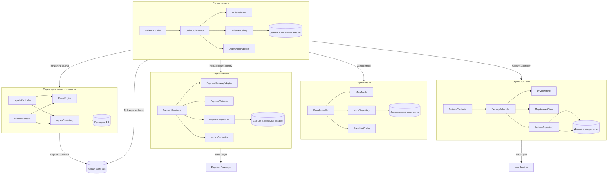
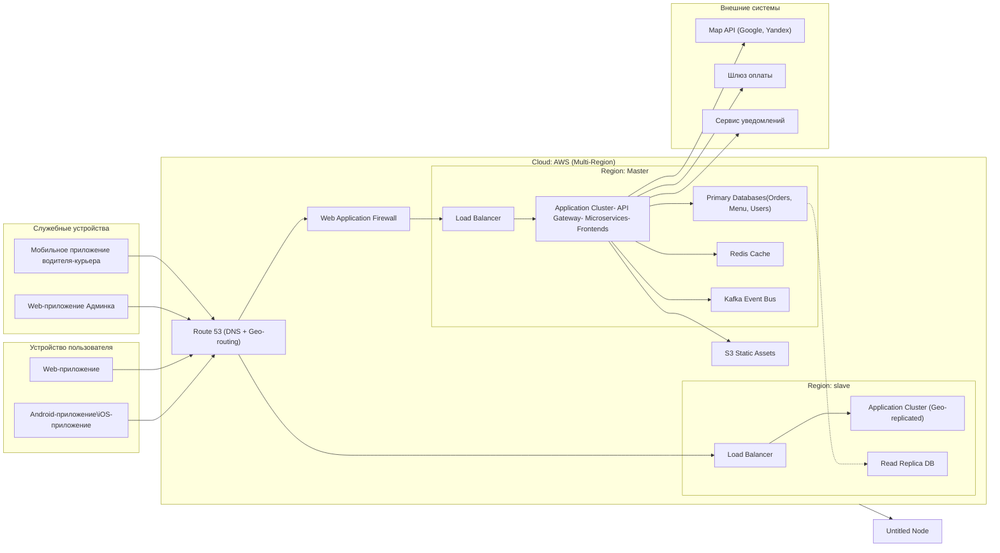

# DZ_01
Выполнение работ для ДЗ_01
Я возьму сэндвич с беконом и салатом (BLT)
# Бизнес-кейс

Крупнейший в стране магазин сэндвичей хочет включить услугу «факс в вашем заказе», но через Интернет (в дополнение к их текущей услуге отправки факсов)

Пользователи: тысячи, возможно, когда-нибудь миллионы

Требования: Пользователи сделают заказ, а затем получат указание времени, когда они смогут забрать свой сэндвич, а также указания, как добраться до магазина (который должен быть интегрирован с несколькими внешними картографическими сервисами, включающими информацию о дорожном движении)
если магазин предлагает услугу доставки, отправьте водителя с сэндвичем к пользователю
доступность мобильных устройств
предлагать ежедневные национальные акции/специальные предложения
предлагать местные ежедневные акции/специальные предложения
принимаем оплату онлайн или лично/при доставке
Дополнительный контекст:
Сэндвич-магазины работают по франшизе, у каждого из них свой владелец.
Головная компания планирует в ближайшем будущем расширить свою деятельность за рубежом.

Цель корпорации — нанять недорогую рабочую силу для максимизации прибыли.

#### Бизнес-драйверы

* Современные клиенты ожидают удобства: заказ через приложение, доставка, персонализированные предложения. Конкуренты уже предлагают такие функции.
* Компания планирует выход за пределы страны. Устаревшая система не поддерживает международные операции.
* Головной офис хочет контролировать бренд и маркетинг, но франчайзи — управлять локальными предложениями и доставкой.
* Корпорация стремится использовать «недорогую рабочую силу» и автоматизировать процессы.
* Сбор данных о предпочтениях клиентов (например, BLT-любители) позволяет запускать таргетированные акции.

#### Бизнес-цели

Для решения этой ситуации компания ставит перед собой следующую бизнес-цель:

* Размещение заказов через веб и мобильные устройства;
* Интеграцию с картографическими сервисами для навигации и информации о трафике;
* Гибкую систему выдачи (самовывоз или доставка);
* Персонализированные национальные и локальные акции;
* Онлайн- и офлайн-оплату;
* Поддержку работы тысяч (в перспективе — миллионов) пользователей;
* Возможность масштабирования за пределы страны.

# Системные требования

## Заинтересованные стороны

* Администратор (безопасность)

    - безопасность — второе название администратора; эти люди занимаются учетными записями пользователей и системой выставления счетов.

* Корпоративный головной офис (Headquarters)
    – Стратегическая цель: рост, прибыль, международная экспансия, контроль бренда.
    – Интересуется масштабируемостью, централизованным маркетингом, снижением издержек.

* Владельцы франшиз (Franchisees)
    – Независимые предприниматели, управляющие отдельными магазинами.
    – Заинтересованы в локальной гибкости: настройке акций, управления доставкой, выборе платёжных методов.
    – Хотят, чтобы платформа не навязывала чрезмерные ограничения и была выгодной.

* Конечные клиенты (End Users / Customers)
    – Делают заказы через мобильные устройства или веб.
    – Ожидают: быстрый заказ, точное время выдачи, удобную навигацию, персонализированные предложения, гибкость оплаты.

* Водители доставки (Delivery Personnel)
    – Могут быть как штатными, так и привлечёнными через партнёрские сервисы.
    – Им нужна простая система получения заказов, маршрутизации и подтверждения доставки.
  
* Поставщики внешних сервисов (External Service Providers)
    – Картографические платформы (Google Maps, Яндекс.Карты и др.) — для навигации и трафика.
    – Платёжные шлюзы (Stripe, PayPal, местные процессинговые системы).
    – SMS/email-сервисы для уведомлений.
    – Облачные провайдеры (AWS, Azure и т.п.) — для хостинга платформы.
  
* Маркетинговая команда (Corporate & Local Marketing Teams)
    – Отвечают за национальные и локальные акции.
    – Нуждаются в инструментах для запуска, таргетинга и анализа эффективности предложений.
  
* Юридический и compliance-отдел (особенно при международной экспансии)
    – Обеспечивает соответствие GDPR, PCI DSS (платежи), локальным законам о доставке и франчайзинге.

## Функциональные требования

* 1. Управление заказами
     
    - Пользователь может создать заказ (выбрать сэндвич, например, BLT, добавить ингредиенты, указать пожелания).
    - Система рассчитывает и отображает ожидаемое время готовности заказа.
    - Пользователь может выбрать способ получения: самовывоз или доставка.
    - Заказ сохраняется в системе и привязывается к конкретному магазину (франшизе).
      
* 2. Интеграция с картографическими сервисами
     
    - При выборе самовывоза система отображает:
     - Местоположение магазина на карте.
    - Маршрут от текущего местоположения пользователя до магазина.
    - Информацию о дорожном движении (пробки, альтернативные маршруты).
    - При выборе доставки система передаёт адрес доставки водителю с оптимизированным маршрутом.
      
* 3. Управление доставкой
     
    - Если магазин поддерживает доставку, система автоматически назначает заказ водителю (или интегрируется с логистическим сервисом).
    - Водитель получает уведомление с деталями заказа и адресом доставки.
    - Пользователь может отслеживать статус доставки в реальном времени.
      
* 4. Маркетинг и акции
     
    - Система отображает пользователю:
    - Национальные ежедневные акции (единые для всей сети).
    - Локальные ежедневные акции (уникальные для выбранного магазина/региона).
    - Акции могут применяться автоматически или вручную при оформлении заказа.
    - Владелец франшизы может настраивать локальные предложения через админ-панель.
      
* 5. Оплата
     
    - Поддержка нескольких способов оплаты:
    - Онлайн: кредитная/дебетовая карта, электронные кошельки (через интеграцию с платёжными шлюзами).
    - При получении: наличные или карта в магазине / у курьера.
    - Система сохраняет статус оплаты и подтверждает успешную транзакцию.
      
* 6. Управление франшизами
     
    - Каждый магазин (франшиза) имеет свой профиль в системе с:
    - Геолокацией.
    - Меню (базовое от головного офиса + локальные дополнения).
    - Статусом доставки (включена/выключена).
    - Временем работы.
    - Головной офис может обновлять базовое меню и национальные акции централизованно.
      
* 7. Уведомления
     
    - Пользователь получает уведомления (push / SMS / email):
    - О подтверждении заказа.
    - О готовности заказа (для самовывоза).
    - О выезде курьера и приближении (для доставки).
    - О завершении заказа.
 
## Требования к характеристикам архитектуры

### 1. Масштабируемость (Scalability)
 
* Система должна поддерживать от нескольких тысяч до миллионов активных пользователей
* Система должна позволять увеличение количества магазинов/франшиз (локальных точек):
    - Разделение горячих (актуальных) и холодных (архивных) данных.
    - Выбор масштабируемых СУБД: Для транзакций — PostgreSQL с репликацией. Для аналитики/акций — ClickHouse.
    - Кэширование частых запросов (например, меню магазина) через Redis или Memcached.
* Система должна позволять расширение географического охвата (новые страны → новые регионы → новые интеграции):
    - Использование шардирования баз данных по регионам или магазинам (например, все заказы из Нью-Йорка — в одном шарде, из Лондона — в другом).
* Архитектура должна позволять горизонтальное масштабирование (добавление экземпляров сервисов под нагрузкой):
      - Каждый микросервис (например, OrderService, UserService, PromotionService) может запускаться в нескольких копиях.
      - При росте числа заказов в обеденное время — автоматически создаются дополнительные инстансы.
      - Использование оркестраторов (Kubernetes) для управления жизненным циклом контейнеров.
      - Балансировка нагрузки через API Gateway или Load Balancer.
      
### 2. Производительность
* Время обработки заказа (от нажатия «Оформить» до подтверждения) — не более 1–2 секунд.
* Ответ внешних интеграций (карты, платёжные шлюзы) должен кэшироваться или обрабатываться асинхронно, чтобы не блокировать пользовательский интерфейс.
* При этом система должна сохранять производительность, стабильность и низкую задержку даже в пиковые нагрузки:
     - Микросервисная архитектура: каждый домен (заказы, доставка, оплата, акции) — отдельный сервис.
     - Чёткие границы контекста (по DDD): изменения в DeliveryService не ломают OrderService.
     - Использование асинхронной коммуникации (через Kafka, RabbitMQ): При создании заказа → событие OrderCreated → триггер для уведомлений, аналитики, доставки. Это снижает связанность и повышает устойчивость к пикам.
       
### 3. Удобство пользования и интернацианольность 
* Поддержка мультиязычности (язык интерфейса определяется по геолокации или настройкам пользователя).
* Отображение цен в местной валюте с актуальными курсами.
* Возможность подключения локальных платёжных провайдеров и картографических сервисов (Google Maps, Яндекс.Карты, Baidu и др.) в зависимости от региона.
  
### 4. Внешние интерфейсы и UX
* Веб-интерфейс должен быть адаптивным и корректно отображаться на всех популярных мобильных устройствах.
* Время загрузки ключевых экранов (меню, оформление заказа) — не более 2 секунд при среднем 4G-подключении.
* Поддержка оффлайн-сценариев (например, сохранение черновика заказа при потере связи).
  

### 5. Безопасность (Security)
* Все платёжные данные должны обрабатываться в соответствии с PCI DSS.
* Персональные данные пользователей должны храниться и быть защищены в соответствии с локальным законодательством (особенно при международной экспансии).
* Аутентификация и авторизация должны использовать современные стандарты (OAuth 2.0, JWT).
* Предусмотреть защиту от DDoS, инъекций, брутфорса и других распространённых атак.
  
### 6. Надёжность и отказоустойчивость
* Общая доступность (uptime) системы — не менее 99.9% (SLA уровня enterprise).
* Отказ одного микросервиса (например, сервис акций) не должен останавливать оформление заказа.
* Данные заказов должны быть защищены от потери (репликация, резервное копирование).
* Поддержка аварийного восстановления (disaster recovery) в другом регионе/облаке.
  
### 7. Поддержка изменений и развёртывание (Maintainability & Deployability)
Возможность независимого развёртывания микросервисов (без полной пересборки системы).
Поддержка CI/CD (непрерывная интеграция и доставка).
Логирование, мониторинг и трассировка (например, через OpenTelemetry, Prometheus, Grafana) для быстрой диагностики проблем.

## Целевая архитектура
В этом разделе описывается целевая архитектура программного обеспечения.

### Доменная модель

Здесь мы обнаружили три основные доменные зоны, каждая из которых имеет отдельную группу архитектурных характеристик:

Клиентские сервисы, такие как подача заявок и управление профилями. 
Они требуют высокой доступности и производительности, поскольку ничто так не раздражает клиентов, как медленная или даже недоступная система. Эта часть системы также должна быть масштабируемой, поскольку рост числа клиентов — ключевой фактор любого бизнеса. Кроме того, клиентскую зону можно изолировать в отдельной сетевой зоне, где разрешены только входящие запросы, что повышает безопасность.

Услуги выставления счетов. Речь идёт о деньгах клиентов. 
Если злоумышленник получит доступ к данным кредитной карты, это обернётся катастрофой и может повлечь за собой юридические последствия. Эта часть системы может потребовать сертификации PCI, поэтому её изоляция от остальной системы значительно упростит процедуру. Это изолированная зона безопасности, куда не поступают запросы с других доменов.

Административные услуги головного офиса или франчайзи. 
Эти специалисты выполняют очень важную работу, но ничего критичного не произойдёт, если создание отчёта займёт немного больше времени или если администратор обновит профиль эксперта на несколько часов позже из-за технического обслуживания или чего-то ещё. Безопасность здесь по-прежнему важна, поскольку учётные данные администратора не могут быть раскрыты, но это совсем не то же самое, что безопасность выставления счёта.

### Системный контекст
На представленной ниже диаграмме контекста системы отображены ключевые пользователи системы и ее внешние зависимости:

Были определены четыре типа пользователей: посетитель, водитель-курьер, головной офис и франчайзи. 
* Посетитель [Customer] - 
Клиент ресторана заказа сэндвичей.
Авторизуется в системе, просматривает меню, оформляет заказы, получает историю покупок и персональные скидки, оплачивает заказ и отслеживает местоположение курьера 

* Курьер
[Delivery Driver]
-
Водитель-курьер ресторана сэндвичей.
Получает тикеты на доставку, видит адрес конечного потребителя и маршрут до его адреса. Передает свои координаты в систему для отслеживания передвижения и расчета времени прибытия

* Головной офис [Head Office] - Главный ЛПР. Управляет платформой на глобальном уровне
Задаёт корпоративную стратегию: национальные акции, базовое меню, стандарты бренда, международную экспансию

* Франчайзи [Franchise Owner] - Владелец франшизы на локальном уровне
Управляет локальным магазином: включает доставку, настраивает локальные акции, корректирует локальное меню

Более подробное описание этих типов представлено на схеме:

### Схема контейнеров
Текущая система демонстрирует крайне низкие показатели доступности, удобства обслуживания, развёртываемости и производительности. Наша цель — разработать новую систему, решающую вышеупомянутые проблемы.

На следующей диаграмме изображена схема контейнеров целевой архитектуры системы:

### Диаграмма компонентов

Диаграмма компонентов увеличивает масштаб отдельного контейнера, показывая компоненты внутри него. 
На следующих диаграммах показанные выше контейнеры/функции более подробно разбиваются на компоненты, которые представляют собой отдельно развертываемые микросервисы.

Диаграмма компонентов составлена для пяти ключевых микросервисов из кейса:

* Сервис меню
* Сервис программы лояльности
* Сервис заказов
* Сервис оплаты
* Сервис доставки

На этом уровне мы показываем:
- Основные компоненты внутри каждого сервиса (классы, модули, контроллеры, репозитории и т.п.);
- Внутренние зависимости между ними;
- Внешние взаимодействия с другими сервисами и базами данных.

#### Описание компонентов по сервисам

1. Menu Service — управление меню и франшизами
MenuController — REST/API для получения меню.
MenuModel — доменные сущности: MenuItem, Category, AllergenInfo.
MenuRepository — доступ к данным меню.
БД: menu_db — хранит базовое и локальное меню, привязанное к franchise_id.
Взаимодействует с Order Service при проверке доступности сэндвича. 

2. Сервис программы лояльности —  проведение национальных и локальных акций, ведения бонусных счетов клиентов, начисление и списание бонусных баллов
LoyaltyController — API для просмотра баллов, истории.
PointsEngine — бизнес-логика: сколько баллов за заказ, как тратить.
EventProcessor — подписывается на события (например, OrderCompleted).
LoyaltyRepository — работа с аккаунтами лояльности.
БД: loyalty_db — данные
 об акциях,
 спецпредложениях,
 бонусных счетах
 пользователей
Использует асинхронную архитектуру: не вызывается напрямую, а реагирует на события. 

3. Сервис заказов — ядро заказов
OrderController —  REST/API для создания/просмотра заказов.
OrderOrchestrator — координирует всё: валидация, оплата, доставка, лояльность.
OrderValidator — проверяет: есть ли сэндвич в меню, открыт ли магазин.
OrderRepository — сохраняет заказ.
OrderEventPublisher — публикует события: OrderCreated, OrderCompleted.
БД: orders_db — шардирована по региону/магазину.
Центральный оркестратор: вызывает другие сервисы, но не зависит от их внутреннего устройства. 

4. Сервис оплаты — обработка оплаты
PaymentController —  REST/API: initiatePayment, confirmPayment.
PaymentValidator — проверка суммы, валюты, поддержки метода.
InvoiceGenerator — создаёт чек/квитанцию.
БД: orders_db  — ссылки на заказы со статусами транзакций оплаты.

5. Delivery Service — управление доставкой
DeliveryController — REST/API: scheduleDelivery, trackStatus.
DeliveryScheduler — логика назначения времени и курьера.
DriverMatcher — находит ближайшего свободного водителя-курьера.
MapAdapterClient — вызывает Google/Yandex/Maps для построения маршрута и расчета времени прибытия.
DeliveryRepository — хранит заказы на доставку.
БД: delivery_db — статусы, координаты, идентификаторы водителей-курьеров.
Интеграция с картами через адаптер, чтобы легко добавлять новые регионы

| Источник          | Назначение           | Тип                     | Цель                     |
|-------------------|-----------------------|------------------------------|----------------------
| Сервис заказов - Сервис Меню    | HTTP/rest      | Синхронный               |Получить актуальное меню и проверить доступность |
| Сервис заказов - Cервис оплаты  | HTTP/rest      | Синхронный             |Заблокировать/подтвердить оплату  |
| Сервис заказов - Сервис доставки  | Event       | Асинхронный   | Создать задачу доставки  |
| Сервис заказов - Kafka       | Event   | Асинхронный       | Опубликовать OrderCompleted  |
| Сервис лояльности - Kafka      | Event    | Асинхронный            | Получить OrderCompleted и начислить баллы  |

### Диаграмма развёртывания (Deployment Diagram)

Диаграмма развертывания иллюстрирует:
- Как системные контейнеры сопоставляются с инфраструктурой:
- Физические или виртуальные узлы (серверы, кластеры, облака, устройства),
- Как компоненты системы (контейнеры) размещаются на этих узлах,
- Сетевые связи и зоны безопасности (например, публичная vs приватная сеть).

